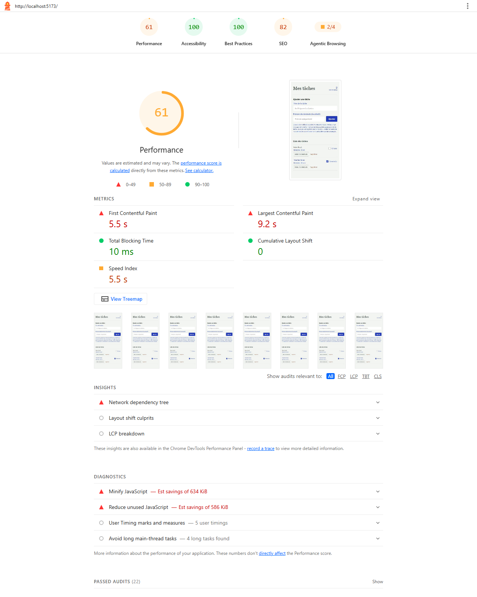
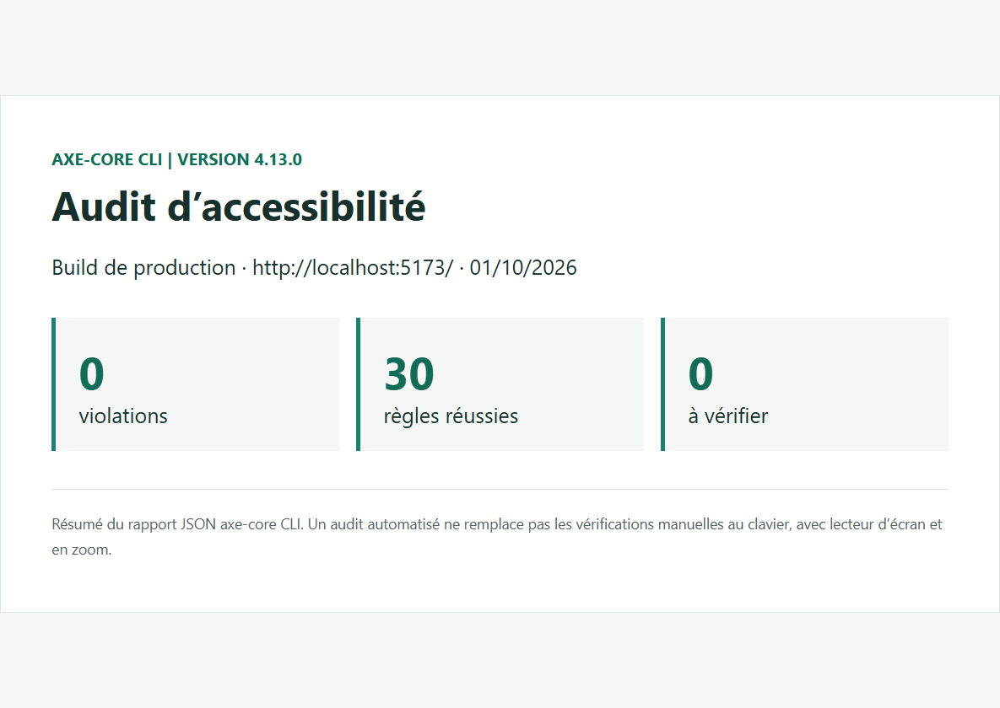

# Gestion des tâches (TP 5)

API Node.js / PostgreSQL (à la racine) + interface React accessible (dossier `frontend`).

- Frontend (Netlify) : https://tp5-ekod.netlify.app/
- API (Render) : `https://<nom-du-service>.onrender.com` (à compléter)

## Lancer le projet en local

```bash
# 1. Variables d'environnement (valeurs fictives à adapter, jamais commitées)
cp .env.example .env
cp frontend/.env.example frontend/.env

# 2. API + base PostgreSQL
docker compose up -d --build        # API sur http://localhost:3000/tasks
# après modification de .env ou de db-init/init.sql : docker compose down -v puis relancer

# 3. Interface React
cd frontend && npm install && npm run dev   # http://localhost:5173
npm run lint                                # ESLint + jsx-a11y
```

## Déploiement

- **Base** : Neon. Exécuter `db-init/init.sql` dans l'éditeur SQL Neon (il met aussi à niveau une base existante).
- **API sur Render** (Web Service, Docker) : le `Dockerfile` à la racine installe les dépendances de l'API (`package.json` racine). Variables d'environnement à définir dans Render (jamais dans le dépôt) :
  - `DATABASE_URL` : URL de connexion Neon (`...?sslmode=require`)
  - `CORS_ORIGIN` : `https://tp5-ekod.netlify.app` (sans `/` final)
- **Frontend sur Netlify** : base directory `frontend`, build `npm run build`, publish `frontend/dist`, variable `VITE_API_URL=https://<nom-du-service>.onrender.com` (sans `/` final).

## Accessibilité

Captures dans `docs/audits/` : Lighthouse (`lighthouse.png`), axe DevTools avant/après correction (`axe-core-cli.png`, `axe-core-cli-final.png`).




## Sécurité : `npm audit`

- Racine (API) : `found 0 vulnerabilities`
- `frontend` : `found 0 vulnerabilities`

## Fiche du traitement

L’association utilise l’application pour organiser les tâches et savoir quel bénévole s’en occupe. Les données enregistrées sont le titre et l’état de la tâche, ainsi que, facultativement, le prénom seul du bénévole; aucun nom de famille, e-mail ou téléphone n’est demandé pour cette fonction.

Le prénom est conservé tant que la tâche existe. Il peut être retiré plus tôt avec le bouton « Retirer le bénévole » ou sur demande à `contact@association.example`; la suppression de la tâche efface aussi son prénom. Les bénévoles peuvent demander l’accès, la rectification ou l’effacement de cette donnée en contactant l’association à cette adresse.

Les personnes autorisées de l’association qui utilisent l’outil et les personnes chargées de son exploitation peuvent accéder aux tâches et au prénom associé. L’application n’intègre pas de traceur ni de script tiers et ne nécessite pas de bandeau cookies.

## Questions

**Pourquoi aucune variable `VITE_` ne contient de secret ?**
Vite copie les variables `VITE_` dans le JavaScript envoyé au navigateur : n'importe quel visiteur peut les lire (onglet Sources ou Réseau). Seule l'URL publique de l'API y figure ; les identifiants de la base (`DATABASE_URL`, `DB_PASSWORD`) restent côté serveur.

**Pourquoi la validation du frontend ne suffit pas ?**
Elle améliore l'expérience (message immédiat), mais elle se contourne : un appel direct à l'API avec curl, Bruno ou un navigateur modifié n'y passe pas. Seule la validation Joi côté API protège réellement les données.

**Pourquoi l'application n'a pas besoin de bandeau cookies ?**
Elle ne dépose aucun cookie ni traceur (pas de statistiques, pas de pixel publicitaire, pas de script tiers). Le bandeau n'est exigé que pour les traceurs non strictement nécessaires.
